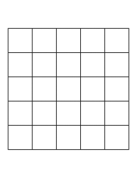

# Two Dimensional Arrays

Our `array` lesson wouldn't be complete without an overview of 2D arrays (or 3D, 4D, etc.)

An array such as `int [] arr = {1,2,3};` is one dimensional. You can add dimensions to your array using the following syntax.

```java
public class Learn {
    public static void main(String[] args) {

        int[][] arr = new int[5][10];
        arr[0][0] = 5;

        System.out.println("arr[0][0] = " + arr[0][0]);

    }
}
```

In this example, we declared `[0][0]` to equal 5, and accessed it using the same syntax.

## Visualizing 2D arrays

2D arrays can be confusing for beginners, and the simplest way to visualize them is by imagining a 2D grid from elementary math class.


_5x5 Grid_

If we were to imagine this as a Java array of integers, we could picture it like this:

```java
public class Learn {
    public static void main(String[] args) {

        int[][] arr = new int[5][5]; //creates 5x5 grid
        arr[0][0] = 5; // first index
        arr[4][4] = 10; // last index

        System.out.println("arr[0][0] = " + arr[0][0]);
        System.out.println("arr[4][4] = " + arr[4][4]);

    }
}
```

```text
5
10
```

Accessing array elements this way is tedious. Luckily, there's a better way to do this with `for` loops. Once we reach that topic, we'll provide you with examples of how to access arrays without having to type `arr[x][y]` out for each element.

