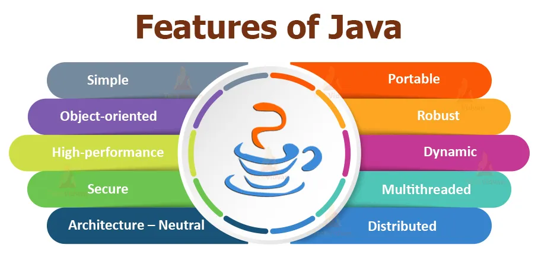

# Markdown Guide

:::info
This page contains markdown examples from two sources

1. Standard Markdown
2. Markdown specific to our site generator, [Docusaurus](https://docusaurus.io/)

All examples will render properly on our webpages, BUT some examples **will not be visible** in a live Markdown previewer, for example. We use [Markdown Preview Enhanced](https://marketplace.visualstudio.com/items?itemName=shd101wyy.markdown-preview-enhanced) in Visual Studio Code, and many things aren't properly rendered in the previewer. Don't worry, it's expected, and as long as the syntax is correct, it'll work once rendered on the website!
:::

# h1 Heading

## h2 Heading

### h3 Heading

#### h4 Heading

##### h5 Heading

###### h6 Heading

```

# h1 Heading
## h2 Heading
### h3 Heading
#### h4 Heading
##### h5 Heading
###### h6 Heading
```

## Horizontal Rules

---

---

---

```
___

---

***
```

## Links

[Link Text](http://dev.nodeca.com)

[Link with Title](http://nodeca.github.io/pica/demo/ "Title Text!")

```
[Link Text](http://dev.nodeca.com)

[Link with Title](http://nodeca.github.io/pica/demo/ "Title Text!")
```

## Images

Images will take up the entire space of their parent container, up to the size of their parent container. If you want to display an image smaller than it actually is, our current workflow is to manually resize the image and upload the resized image. (e.g. 3000x2000 is huge, and we aren't displaying that whole image. So, we manually resize it to 750x500, for example). This saves bandwidth, and increases page load times.

We're currently working on a short guide for this, and we will link to it once complete.

You can also write HTML directly in Markdown, and use `` attributes such as `width=200px`, but we do not recommend this. The images will still have large filesizes, and this may negatively affect responsive design.




```


```

## Emphasis

**This is bold text**

**This is bold text**

_This is italic text_

_This is italic text_

~~Strikethrough~~

```
**This is bold text**

__This is bold text__

*This is italic text*

_This is italic text_

~~Strikethrough~~
```

## Blockquotes

> Blockquotes can also be nested...
>
> > ...by using additional greater-than signs right next to each other...
> >
> > > ...or with spaces between arrows.

```
> Blockquotes can also be nested...
>> ...by using additional greater-than signs right next to each other...
>>> ...or with spaces between arrows.
```

## Admonitions

:::note
Some **content** with _markdown_ `syntax`.
:::
:::tip
Some **content** with _markdown_ `syntax`.
:::
:::info
Some **content** with _markdown_ `syntax`.
:::
:::caution
Some **content** with _markdown_ `syntax`.
:::
:::danger
Some **content** with _markdown_ `syntax`.
:::
:::note Your Custom Title Here!
Some **content** with _markdown_ `syntax`.
:::
:::caution Custom title, plus you can specify which adminition!
Some **content** with _markdown_ `syntax`.
:::

```
:::note
Some **content** with _markdown_ `syntax`.
:::

:::tip
Some **content** with _markdown_ `syntax`.
:::

:::info
Some **content** with _markdown_ `syntax`.
:::

:::caution
Some **content** with _markdown_ `syntax`.
:::

:::danger
Some **content** with _markdown_ `syntax`.
:::

:::note Your Custom Title Here!
Some **content** with _markdown_ `syntax`.
:::

:::caution Custom title, plus you can specify which adminition!
Some **content** with _markdown_ `syntax`.
:::

```

## Lists

Unordered

- Create a list by starting a line with `+`, `-`, or `*`
- Sub-lists are made by indenting 2 spaces OR 1 Tab:
  - You can use different symbols for lists (see the code below!)
    - Ac tristique libero volutpat at
    * Facilisis in pretium nisl aliquet
    - Nulla volutpat aliquam velit
- Very easy!

Ordered

1. Lorem ipsum dolor sit amet
2. Consectetur adipiscing elit
3. Integer molestie lorem at massa

Start numbering with offset:

158. foo
159. bar

```
Unordered

+ Create a list by starting a line with `+`, `-`, or `*`
+ Sub-lists are made by indenting 2 spaces:
  - Marker character change forces new list start:
    * Ac tristique libero volutpat at
    + Facilisis in pretium nisl aliquet
    - Nulla volutpat aliquam velit
+ Very easy!

Ordered

1. Lorem ipsum dolor sit amet
2. Consectetur adipiscing elit
3. Integer molestie lorem at massa

Start numbering with offset:

158. foo
159. bar
```

## Code

Inline `code`

Indented code

    // Some comments
    line 1 of code
    line 2 of code
    line 3 of code


Block code "fences" **(this is the method we recommend, however you may use whichever you prefer)**

```
Sample text here...
```

```text
If you have a Markdown linter installed, you can remove the warning by labeling the block as "text"
```

Syntax highlighting

``` js
var foo = function (bar) {
  return bar++;
};

console.log(foo(5));
```

````
Inline `code`

Indented code

    // Some comments
    line 1 of code
    line 2 of code
    line 3 of code


Block code "fences"

```
Sample text here...
```

```text
If you have a Markdown linter installed, you can remove the warning by labeling the block as "text"
```

Syntax highlighting

``` js
var foo = function (bar) {
  return bar++;
};

console.log(foo(5));
```
````

## Tables

| Option | Description                                                               |
| ------ | ------------------------------------------------------------------------- |
| data   | path to data files to supply the data that will be passed into templates. |
| engine | engine to be used for processing templates. Handlebars is the default.    |
| ext    | extension to be used for dest files.                                      |

Right aligned columns

| Option |                                                               Description |
| -----: | ------------------------------------------------------------------------: |
|   data | path to data files to supply the data that will be passed into templates. |
| engine |    engine to be used for processing templates. Handlebars is the default. |
|    ext |                                      extension to be used for dest files. |

```
| Option | Description |
| ------ | ----------- |
| data   | path to data files to supply the data that will be passed into templates. |
| engine | engine to be used for processing templates. Handlebars is the default. |
| ext    | extension to be used for dest files. |

Right aligned columns

| Option | Description |
| ------:| -----------:|
| data   | path to data files to supply the data that will be passed into templates. |
| engine | engine to be used for processing templates. Handlebars is the default. |
| ext    | extension to be used for dest files. |
```

### Footnotes

Footnote 1 link[^1].

Footnote 2 link[^2].

Duplicated footnote reference[^2].

**Footnotes will appear at bottom of this page**

[^1]: Footnote **can have markup**

    and multiple paragraphs.

[^2]: Footnote text.

```markdown
Footnote 1 link[^1].

Footnote 2 link[^2].

Duplicated footnote reference[^2].

**Footnotes will appear at bottom**

[^1]: Footnote **can have markup**

    and multiple paragraphs.

[^2]: Footnote text.
```

### Figcaptions

Markdown does not natively support figcaptions (at least not at the time of writing this). It's worth noting that you can write HTML directly in Markdown files, but we've found a way to simplify this process.

Instead of using figcaptions to caption images, we'll be using a little shortcut [found on Stack Overflow](https://stackoverflow.com/questions/19331362/using-an-image-caption-in-markdown-jekyll). Simply place the image using markdown (as shown earlier), then place italicized text after using `*write caption here*` with the caption inside of it. When compiled to HTML, this will place `<em>` tags around the text, and using a CSS rule `img + em { }`, we turn this into a caption. For example,


_Image from https://techvidvan.com/tutorials/java-introduction/_

```markdown

_Image from https://techvidvan.com/tutorials/java-introduction/_
```

### Anything else?

:::note TODO
Update with more Markdown features.
:::

### See the footnotes below?

Remember when we wrote footnotes? They automatically appear at the bottom! ⬇️
